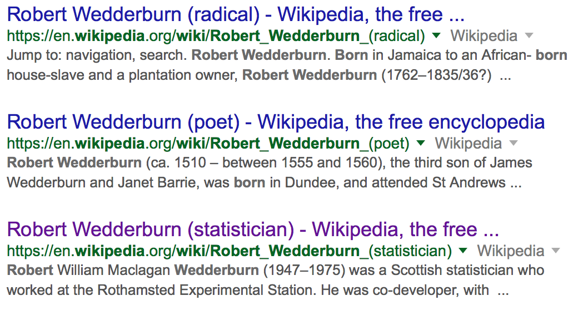

# Who are Nelder and Wedderburn?

- Why are they important?
- Where/when did they work?

# John Nelder
- 1924 - 2010
- Graduated from Cambridge
- Worked at the prestigious National Vegetable Research Station
- Visiting Professor at Imperial College London from 1972 - 1984
- Developed statistical software such as GLIM

# 

# Robert Wedderburn
- 1947 - 1975 (died at 28)
- Also graduated from Cambridge
- Worked at  Rothamsted Experimental Station where he developed GLMs with Nelder.

# What is a GLM?
- Generalizes several different "linear models"
- Uses a link function to "link" linear model to a response
    - In the paper, unifies normal, logistic, poisson and gamma

# How does one fit a GLM?
- Using Newton's method to find the MLE
    - Equivalent to an iterative weighted least squares.
    - Starting method: set $\mu=z$ to obtain initial weights and coefficients (may need slight modification, e.g. binomial).
    - Avoid numerical differentialtion.
- Analysis of deviance
    - The models should be ordered (e.g. main effect -> interaction terms).
    - Deviance measures the distance from the complete model, chi-squared distribution.
    - Stop fitting when residual df. * scale factor = deviance of current model (*).

# How does one fit a GLM?

- Examples
    - Poisson distribution: model contingency tables (multiplicative effect, qualitative x's).
    - Binomial distribution: probit analysis.
    - Gamma distribution: estimation of variance components.

# What did you find interesting about the article?
- Tried to put myself in the shoes of people at this time period
- Before this GLM paper, it seems like linear models were the purview of statisticians only
- not so easily implemented (computationally)
- Now, these disparate linear models are grouped into one procedure
- For better or worse anyone can use GLMs now to make inference about regression parameters
- Write Newton-Rhapson as iterative weighted least squares.
- The use of sufficient statistics in GLM fitting.
- Use deviance to assess model fitting (which reminds me of likelihood ratio test).
